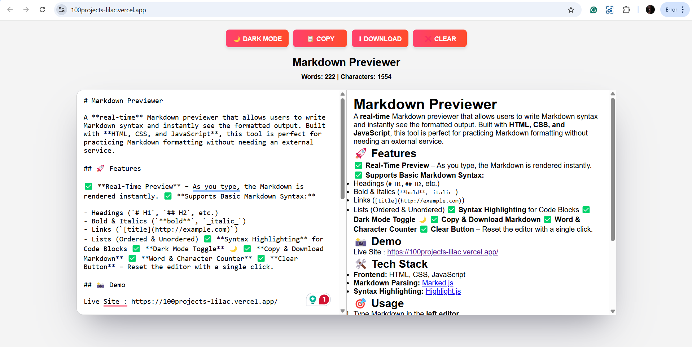

# Markdown Previewer

A **real-time** Markdown previewer that allows users to write Markdown syntax and instantly see the formatted output. Built with **HTML, CSS, and JavaScript**, this tool is perfect for practicing Markdown formatting without needing an external service.

## 🚀 Features

✅ **Real-Time Preview** – As you type, the Markdown is rendered instantly. ✅ **Supports Basic Markdown Syntax:**

- Headings (`# H1`, `## H2`, etc.)
- Bold & Italics (`**bold**`, `_italic_`)
- Links (`[title](http://example.com)`)
- Lists (Ordered & Unordered) ✅ **Syntax Highlighting** for Code Blocks ✅ **Dark Mode Toggle** 🌙 ✅ **Copy & Download Markdown** ✅ **Word & Character Counter** ✅ **Clear Button** – Reset the editor with a single click.

## 📸 Demo

Live Site : https://100projects-lilac.vercel.app/

## 🛠️ Tech Stack

- **Frontend:** HTML, CSS, JavaScript
- **Markdown Parsing:** [Marked.js](https://marked.js.org/)
- **Syntax Highlighting:** [Highlight.js](https://highlightjs.org/)

## 🎯 Usage

1. Type Markdown in the **left editor**.
2. See the **formatted output** on the right in real-time.
3. Use the buttons for additional features:
   - **Dark Mode:** Toggle between light and dark themes.
   - **Copy:** Copy the Markdown text to the clipboard.
   - **Download:** Save your Markdown as a `.md` file.
   - **Clear:** Reset the editor.

## 🤝 Contributing

Feel free to **fork** this repository and submit a pull request if you have any improvements!

---

### 👨‍💻 Developed by [Rakshith Santosh](https://github.com/rakshithsantosh) 🚀
